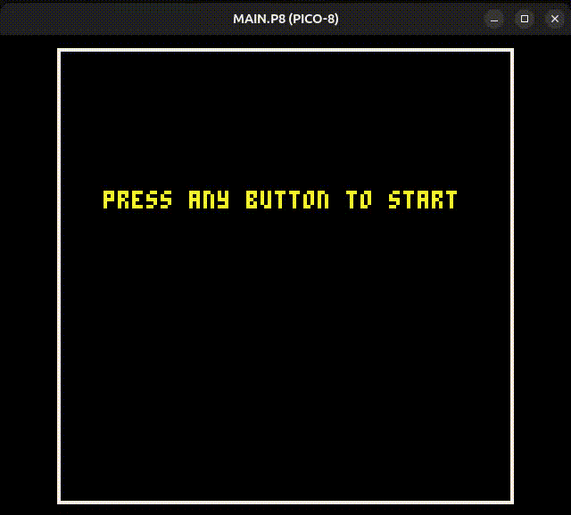

# poggle

## A boggle remake for Pico-8

## Table of Contents
- [Development Setup](#development-setup)
- [Using the Debugger](#using-the-debugger)

## Sample

## Development Setup

For development purposes, create a shortcut of the PICO-8 executable and prefix the target with the following command:

C:\Windows\System32\cmd.exe /c "C:\Program Files (x86)\PICO-8\pico8.exe"

## Using the Debugger

To begin development and simultaneously open PICO-8 along with a terminal window, use this command:

& 'c:\Program Files (x86)\PICO-8\pico8_debug.lnk'
